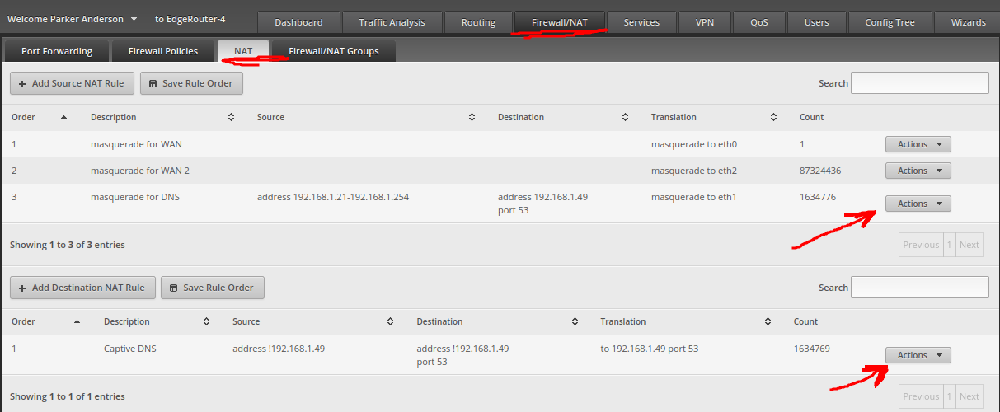
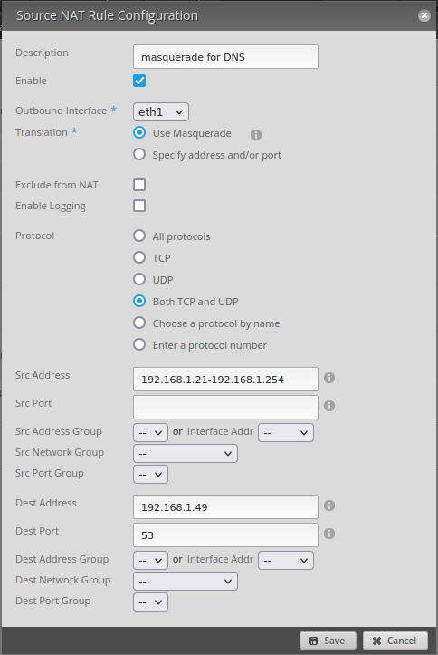
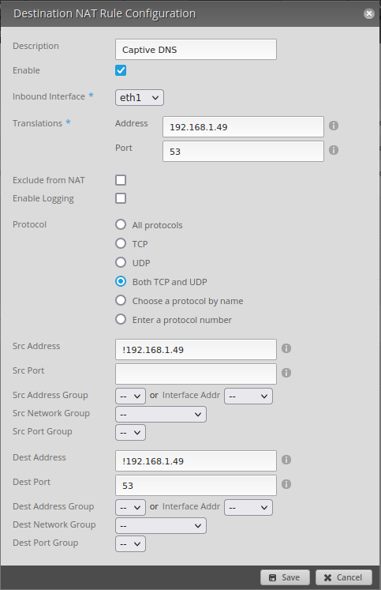

These are the Edge Router settings that are used to force all devices to use Pihole DNS.

**If the pi server goes down**, to quickly restore internet access, simply change the ip address from `192.168.1.49` to `192.168.1.196`

